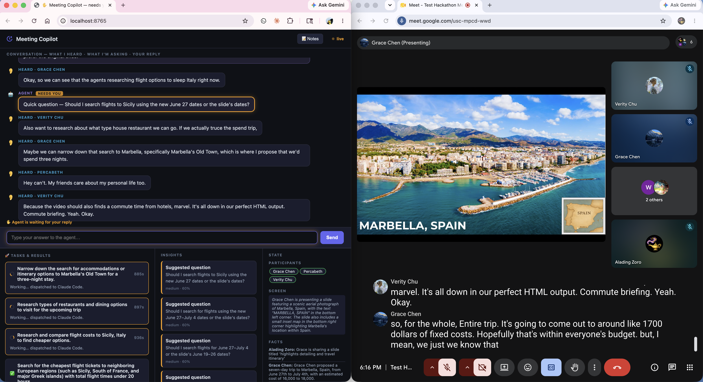

# Meeting Copilot — Architecture

**Perception → Planning → Action.** A meeting agent that watches your screen and
captions, reasons over your own docs with Gemini/Claude, and *privately* surfaces
contradictions, questions, and dispatched tasks — without ever posting into the meeting.

## System diagram

```
                          MEETING COPILOT
              Perception  →  Planning  →  Action

┌─────────────────────┐   ┌─────────────────────┐   ┌─────────────────────┐
│   👁  PERCEPTION    │   │   🧠  PLANNING       │   │   📋  ACTION        │
│  (watch the meeting)│   │  (the agent brain)  │   │ (private side panel)│
├─────────────────────┤   ├─────────────────────┤   ├─────────────────────┤
│ • Screen → vision   │   │ Orchestrator runs   │   │ Web UI @ :8765      │
│ • Meet captions     │   │ 6 sub-agents:       │   │ • Conversation      │
│ • Audio (backup)    │   │   Thinker           │   │ • Tasks & Results   │
│                     │   │   Questioner        │   │ • Notes             │
│                     │   │   Learner           │   │                     │
│                     │   │   Transcriber       │   │ (nothing posted     │
│                     │   │   Researcher        │   │  into the meeting)  │
│                     │   │   Executor          │   │                     │
└─────────┬───────────┘   └──────────┬──────────┘   └──────────▲──────────┘
          │  observation             │  decision               │
          └──────────────►  EVENT BUS (asyncio pub/sub)  ◄──────┘
                          + shared MEETING STATE
```

## Tools we use

| Layer        | Tools |
|--------------|-------|
| **Perception** | `mss` + `Pillow` (screen) · Chrome DevTools Protocol (captions) · `sounddevice` (audio) → **Gemini Vision** |
| **Planning**   | **Gemini** (`google-genai`) **or Claude** (`anthropic` SDK) · Executor → **Claude Code CLI** / **Gemini Managed Agents** |
| **Action**     | **FastAPI** + **Uvicorn** + **WebSockets** |
| **Glue**       | Python **asyncio** event bus · **Pydantic** (the two contracts) |

**In one line:** screen + captions come in → 6 Gemini/Claude agents reason over your
own docs → it privately surfaces contradictions, questions, and dispatched tasks.
Layers talk only through the bus, so any piece swaps without touching the rest.

## Live demo

Left: the agent's private side panel. Right: the real Google Meet it's watching.
It heard the trip discussion, **asked a clarifying question** ("June 27 dates or the
slide's dates?"), and **dispatched research tasks to Claude Code** — all live.


